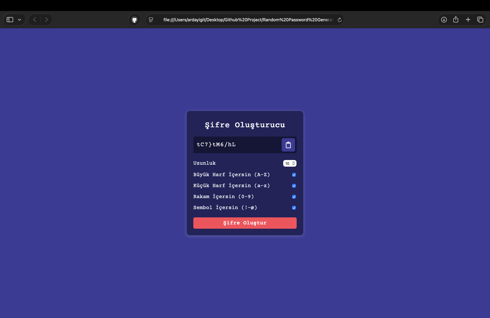

# Random-Password-Generator
# 🔐 Secure Password Generator


**Secure Password Generator**, kullanıcıların belirlediği kriterlere (uzunluk, sembol, sayı vb.) göre rastgele ve güçlü şifreler üreten web tabanlı bir araçtır.

Bu proje, verileri sunucuya göndermeden tamamen **istemci taraflı (client-side)** çalışarak maksimum güvenlik sağlar.

## 🚀 Canlı Demo

[>> Şifre Oluşturucuyu Denemek İçin Tıkla <<](https://ygtarda.github.io/Random-Password-Generator)
## 📸 Ekran Görüntüsü


## ✨ Özellikler

* **🎛️ Tam Özelleştirme:** Şifre uzunluğunu, büyük/küçük harf, rakam ve sembol kullanımını ayarlayabilirsiniz.
* **📋 Tek Tıkla Kopyalama:** Oluşturulan şifreyi panoya (clipboard) anında kopyalama özelliği.
* **🔒 İstemci Taraflı Güvenlik:** Şifreler tarayıcınızda üretilir, hiçbir veritabanına kaydedilmez.
* **🎨 Modern Arayüz:** Kullanıcı dostu ve şık tasarım.

## 🛠️ Kullanılan Teknolojiler

* **Vanilla JavaScript:** Şifre üretim algoritması ve DOM etkileşimleri.
* **ASCII Character Codes:** Rastgele karakter seçimi için matematiksel yöntemler.
* **Clipboard API:** Kullanıcı deneyimini iyileştirmek için kopyalama fonksiyonu.
* **CSS3:** Responsive ve modern stil tanımlamaları.

## 🧠 Nasıl Çalışır?

Uygulama, **Generator Functions** mantığıyla çalışır. Her karakter türü (Harf, Sayı, Sembol) için ayrı fonksiyonlar (`getRandomLower`, `getRandomUpper` vb.) `Math.random()` ve `String.fromCharCode()` kullanarak rastgele değer üretir. Seçilen kriterlere göre bu fonksiyonlar bir döngü içinde çağrılır ve final şifre oluşturulur.

## 💻 Kurulum ve Çalıştırma

Projeyi yerel bilgisayarınızda çalıştırmak için:

1.  **Repoyu Klonlayın**
    ```bash
    git clone [https://github.com/ygtarda/Random-Password-Generator.git](https://github.com/ygtarda/Random-Password-Generator.git)
    ```

2.  **Klasöre Girin**
    ```bash
    cd password-generator
    ```

3.  **Başlatın**
    `index.html` dosyasını tarayıcınızda açmanız yeterlidir.

## 👤 Yazar

**Arda Yiğit**
* GitHub: [@ygtarda](https://github.com/ygtarda)
* LinkedIn: [Arda Yiğit](https://www.linkedin.com/in/arda-yigit)

---
*If you find this tool useful, please give it a ⭐!*